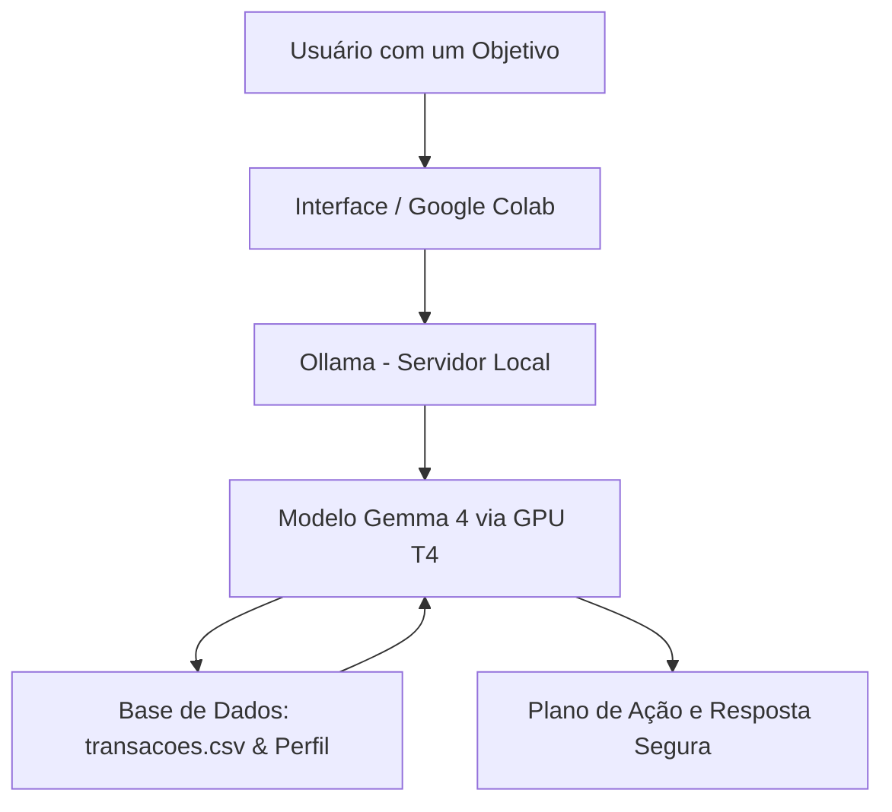

# PoupaSonho - O Seu Assistente de Metas Financeiras

> Agente de Inteligência Artificial autônomo e 100% local, desenvolvido para analisar suas finanças e ajudar você a alcançar seus maiores objetivos financeiros com total privacidade.

## O Que é o PoupaSonho?

O PoupaSonho é um assistente financeiro inteligente focado em **transformar dados em conquistas**. Ele entende que poupar por poupar é difícil, por isso, ele cruza a sua realidade financeira atual (seus gastos) com os seus **objetivos financeiros** (comprar um carro, fazer uma viagem, montar reserva de emergência), traçando o melhor caminho para você chegar lá. Tudo isso com foco absoluto em **soberania de dados** (processamento 100% local).

**O que o PoupaSonho faz:**

- ✅ Ajuda a traçar e acompanhar planos para **objetivos financeiros**.
- ✅ Analisa o histórico do arquivo `transacoes.csv` localmente para encontrar oportunidades de economia.
- ✅ Adapta conselhos ao perfil cadastrado (ex: Conservador), priorizando a segurança do seu dinheiro.
- ✅ Mantém o contexto da conversa, lembrando das suas metas ao longo do chat.

**O que o PoupaSonho NÃO faz:**

- ❌ Não envia seus dados financeiros e sonhos para servidores na nuvem.
- ❌ Não faz recomendações de alto risco que fujam do seu perfil de investidor.
- ❌ Não tenta prever o mercado de ações (foco em organização, não em especulação).

## Arquitetura



**Stack:**

- **Ambiente:** Google Colab (Aceleração por GPU T4) / Ambiente Local
- **LLM Engine:** Ollama
- **Modelo:** gemma4 (Google Open Model)
- **Manipulação de Dados:** Python e Pandas

## Estrutura do Projeto

```
├── data/                          # Base de conhecimento
│   ├── perfil_investidor.json     # Perfil do cliente
│   ├── transacoes.csv             # Histórico financeiro
│   ├── historico_atendimento.csv  # Interações anteriores
|   ├── desafios_economia.json     # Desafios para sugestão
│   └── produtos_financeiros.json  # Produtos para ensino
│
├── docs/                          # Documentação completa
│   ├── 01-documentacao-agente.md  # Caso de uso e persona
│   ├── 02-base-conhecimento.md    # Estratégia de dados
│   ├── 03-prompts.md              # System prompt e exemplos
│   ├── 04-metricas.md             # Avaliação de qualidade
│   └── 05-pitch.md                # Apresentação do projeto
│
└── src/
    └── PoupaSonho.ipynb           # Solução notebook + streamlit + localtunnel
```

## Como Executar (Google Colab)

### 1. Configurar Hardware

Antes de rodar o código, garanta que o Colab está usando aceleração:

> Ambiente de execução > Alterar o tipo de ambiente de execução > Selecionar GPU T4

### 2. Instalar Dependências (Ollama + Gemma 4)

No notebook, execute a célula com os comandos de inicialização:

```bash
# Atualizar sistema e instalar dependências
!update && apt install zstd
!curl -fsSL https://ollama.com/install.sh | sh

# Baixar o modelo gemma4 (pode levar alguns minutos)
!ollama pull gemma4
```

### 3. Inicializar o Agente

Rode a célula Python que inicia o servidor do Ollama em background e carrega as ferramentas de leitura do seu histórico financeiro.

## Exemplos de Uso (Foco em Objetivos)

**Pergunta (Definindo a Meta):** "Quero juntar R$ 5.000 para uma viagem no fim do ano. Onde eu posso cortar gastos com base no meu histórico?"

**PoupaSonho:** "Que ótimo objetivo! Analisando seu transacoes.csv, notei que sua maior despesa variável este mês foi com Delivery (R$ 450,00). Se reduzirmos isso pela metade, você já poupa R$ 225 por mês. Vamos traçar um plano usando cortes em gastos não essenciais?"

**Pergunta (Retenção de Contexto):** "E se eu cortar isso, em quanto tempo consigo os R$ 5.000?"

**PoupaSonho:** "Considerando a economia de R$ 225 do Delivery que conversamos, mais os R$ 300 que já sobram do seu orçamento atual, você teria R$ 525 mensais. Nesse ritmo, você alcançará sua viagem de R$ 5.000 em aproximadamente 10 meses! Como seu perfil é conservador, sugiro deixar esse dinheiro rendendo no Tesouro Selic enquanto o dia da viagem não chega."

## Métricas de Avaliação

O PoupaSonho é testado rigorosamente com base em 4 pilares:

| Métrica | O que avalia | Objetivo no PoupaSonho |
|---|---|---|
| Assertividade | Leitura de Dados | Garantir que as contas para atingir as metas batam com os valores reais do CSV. |
| Segurança | Anti-Alucinação | Evitar que o agente invente rendimentos milagrosos para acelerar o objetivo. |
| Coerência | Respeito ao Perfil | Garantir que o plano de ação seja viável para a realidade (e perfil de risco) do usuário. |
| Retenção de Contexto | Memória Contínua | Lembrar qual é o "sonho" (objetivo) do usuário ao longo das várias interações. |

## Diferenciais do Projeto

- **Orientado a Sonhos:** Em vez de apenas mostrar gráficos frios de despesas, o foco é construir um caminho prático para metas reais.
- **Privacidade Absoluta:** Ideal para rodar dados financeiros sensíveis, pois todo o processamento com o gemma4 ocorre na própria máquina/sessão, sem envio para terceiros.
- **Eficiência de Hardware:** Otimizado para funcionar rapidamente na GPU T4 gratuita do Google Colab.
